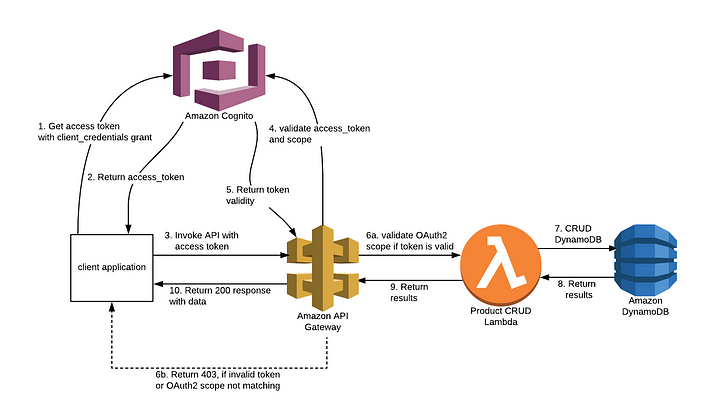

# AWS Cognito Demos

This project currently contains a Terraform-deployed app that demonstrates how to secure an API Gateway REST API with Cognito using the OAuth2 flow.

## Project Layout
- The `terraform-components/` folder contains the Terraform code for Lambda, API Gateway, and Cognito
- The Lambdas perform CRUD operations against a DynamoDB table.
- The Cognito module creates a Cognito User Pool.
- The API Gateway module creates a REST API using OpenAPI. 
- The modules are intentionally generic so that they can be reused in multiple apps.
- The `demo-apps/` folder contains apps that are created by assembling the Terraform modules using Terragrunt. 

## The Apps Thus Far

### Securing AWS API Gateway using AWS Cognito OAuth2 scopes
This app is defined in [`demo-apps/oauth2-apigw-cognito`](demo-apps/oauth2-apigw-cognito) and is based on [an article](https://awskarthik82.medium.com/part-1-securing-aws-api-gateway-using-aws-cognito-oauth2-scopes-410e7fb4a4c0) that demonstrates how to create an OAuth2 solution with AWS Cognito and API Gateway by manually creating the components using the AWS Console. After following the article to manually create the solution, I created and embellished this app as a Terraform/Terragrunt solution.

